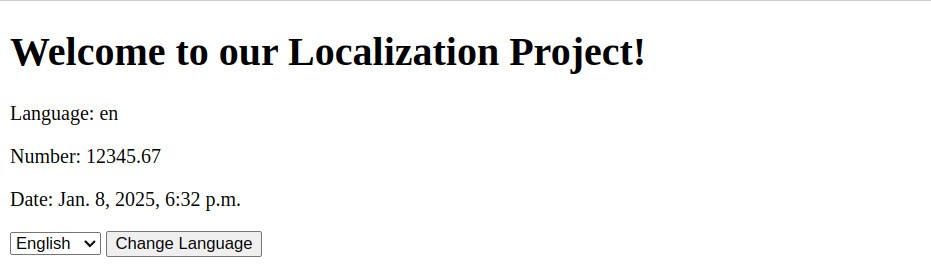
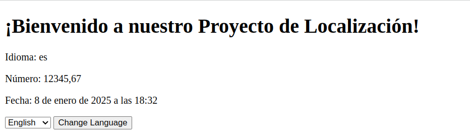
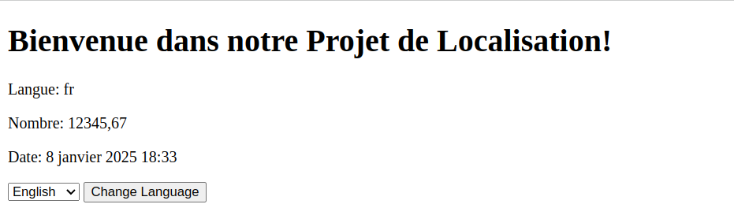

# i18n

This project shows how i18n and i10n work in a Django project.

## Run

```bash
python -m venv .venv
source .venv/bin/activate
make install migrate run
```

## Screenshots

**English**



**Spanish**



**French**


