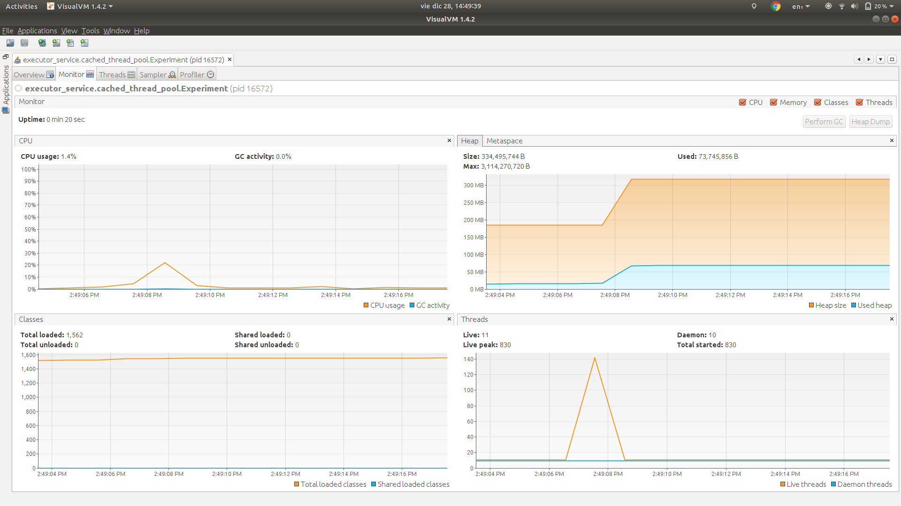
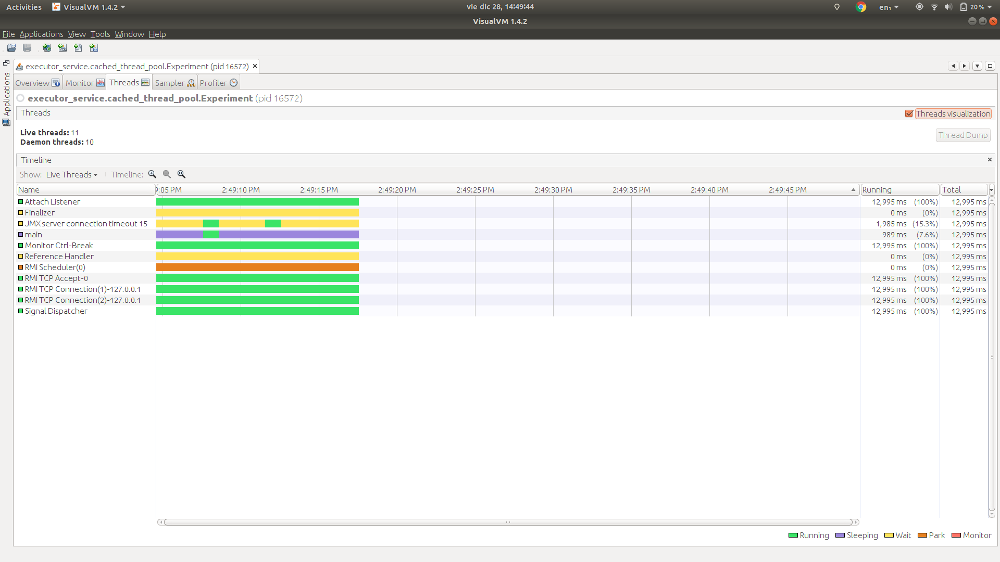
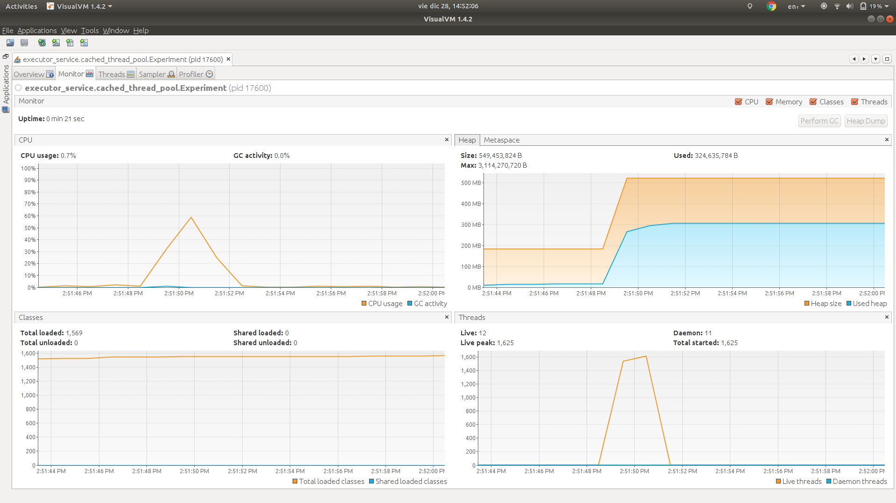
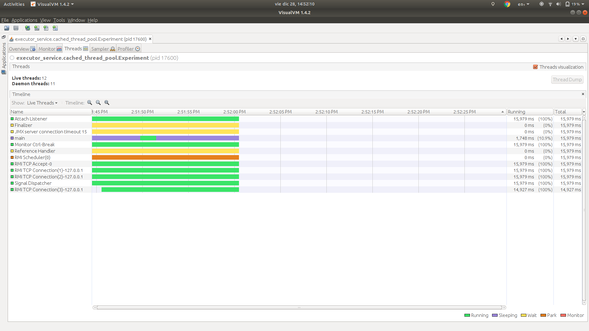
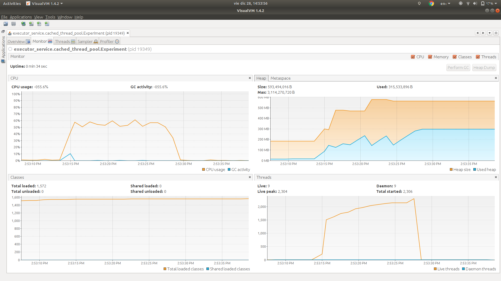
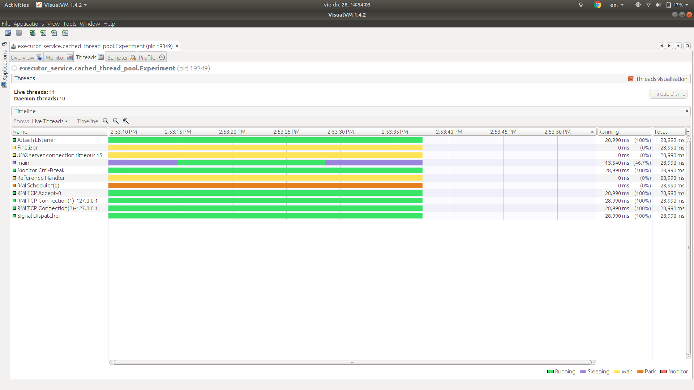

# Cached thread pool

> public static ExecutorService newCachedThreadPool()
> 
> Creates a thread pool that creates new threads as needed, but will reuse previously constructed threads when they are available. These pools will typically improve the performance of programs that execute many short-lived asynchronous tasks. Calls to execute will reuse previously constructed threads if available. If no existing thread is available, a new thread will be created and added to the pool. Threads that have not been used for sixty seconds are terminated and removed from the cache. Thus, a pool that remains idle for long enough will not consume any resources. Note that pools with similar properties but different details (for example, timeout parameters) may be created using ThreadPoolExecutor constructors.

Source: https://docs.oracle.com/javase/7/docs/api/java/util/concurrent/Executors.html#newCachedThreadPool()

## Description

We have three experiments in this package:

### 1. Send 10k tasks to a cached thread pool.

In this experiment we will check:

1. 10_000 tasks are created.
1. All 10_000 tasks are dispatched using the cached thread pool.
  
#### Results

**Stdout**

```
Name: Thread 9730, sum: 194376
Name: Thread 9855, sum: 409060
Name: Thread 9849, sum: 116403
Name: Thread 9738, sum: 186966
Name: Thread 9831, sum: 155403
Name: Thread 9845, sum: 20706
Name: Thread 9829, sum: 63903
Name: Thread 9839, sum: 154846
Name: Thread 9821, sum: 29646
Name: Thread 9712, sum: 4465
Name: Thread 9823, sum: 292230
Name: Thread 9822, sum: 448878
Name: Thread 9803, sum: 15400
Name: Thread 9727, sum: 228150
Name: Thread 9779, sum: 236328
Name: Thread 9765, sum: 137550
Name: Thread 9725, sum: 281625
Name: Thread 9750, sum: 449826
Name: Thread 9627, sum: 73536
```

Note the execution of the threads is NOT in order. This is because we are using a thread pool that grows as it needs.
Additionally is worth highlighting the fact that the difference between threads numbers is greater than in the fixed
thread pool experiment. Why? Because the cached thread pool can create up to `Integer.MAX_VALUE` threads.   

**VisualVM**

Monitor



* The thread count baseline is 11.
* The thread count increases to around 140, why? Because the cached thread pool creates as much threads as needed to perform the given tasks as fastest as possible.
* The thread count goes back to 11, why? Because all threads created by the cached thread pool were shutdown.

* The CPU usage is tops around 20%
* The memory usage is around 70MB

Threads



We can see there are no threads from the cached thread pool alive when the program finishes.

### 2. Send 100k tasks to a cached thread pool.

This experiment pretends to show the difference in consumption of CPU, Memory and threads created when we want to execute 
100k tasks using a cached thread pool.

For this reason we will jump straight to the VisualVM section.

#### Results

**VisualVM**

Monitor



* The thread count baseline is 11.
* The thread count increases to around 1600, why? Because the cached thread pool creates as much threads as needed to perform the given tasks as fastest as possible.
* The thread count goes back to 11, why? Because all threads created by the cached thread pool were shutdown.

* The CPU usage is tops around 60%
* The memory usage is around 300MB

Threads



We can see there are no threads from the cached thread pool alive when the program finishes.

### 3. Send 1M tasks to a cached thread pool.

This experiment pretends to show the difference in consumption of CPU, Memory and threads created when we want to execute 
1M tasks using a cached thread pool.

For this reason we will jump straight to the VisualVM section.

#### Results

**VisualVM**

Monitor



* The thread count baseline is 11.
* The thread count increases to around 2300, why? Because the cached thread pool creates as much threads as needed to perform the given tasks as fastest as possible.
* The thread count goes back to 11, why? Because all threads created by the cached thread pool were shutdown.

* The CPU usage tops around 60%
* The memory usage is around 300MB

Threads



We can see there are no threads from the cached thread pool alive when the program finishes.