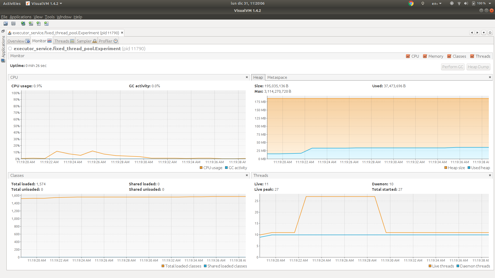
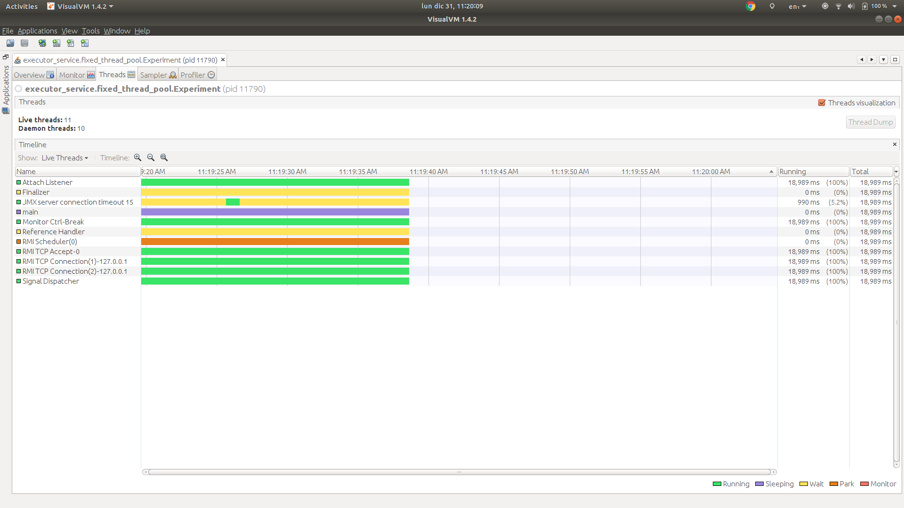

# Fixed thread pool


> public static ExecutorService newFixedThreadPool(int nThreads)
> 
> Creates a thread pool that reuses a fixed number of threads operating off a shared unbounded queue. At any point, at most nThreads threads will be active processing tasks. If additional tasks are submitted when all threads are active, they will wait in the queue until a thread is available. If any thread terminates due to a failure during execution prior to shutdown, a new one will take its place if needed to execute subsequent tasks. The threads in the pool will exist until it is explicitly shutdown.

Source: https://docs.oracle.com/javase/7/docs/api/java/util/concurrent/Executors.html#newFixedThreadPool(int)

## Description

We have one experiment in this package:

### 1. Send 10k tasks to a fixed thread pool of 16 threads.

In this experiment we will check:

1. 10_000 tasks are created.
1. Only 16 extra threads are created.
1. All 10_000 tasks are dispatched using the new 16 threads.
  
#### Results

**Stdout**

```
Name: Thread 9989, sum: 392941
Name: Thread 9988, sum: 12561
Name: Thread 9990, sum: 18915
Name: Thread 9995, sum: 91806
Name: Thread 9996, sum: 117855
Name: Thread 9998, sum: 4095
Name: Thread 9993, sum: 230860
Name: Thread 9999, sum: 392055
Name: Thread 9997, sum: 339900
Name: Thread 9992, sum: 100128
Name: Thread 10000, sum: 126253
Name: Thread 9991, sum: 118341
Name: Thread 9994, sum: 4950
```

Note the execution of the threads is NOT in order. This is because we are using a fixed thread pool of 16 threads.

**VisualVM**

Monitor



* The thread count baseline is 11.
* The thread count increases to 27, why? Because the 16 threads of the fixed thread pool were created.
* The thread count goes back to 11, why? Because the 16 threads of the fixed thread pool were shutdown.

Threads



We can see there are no threads from the fixed thread pool alive when the program finishes.