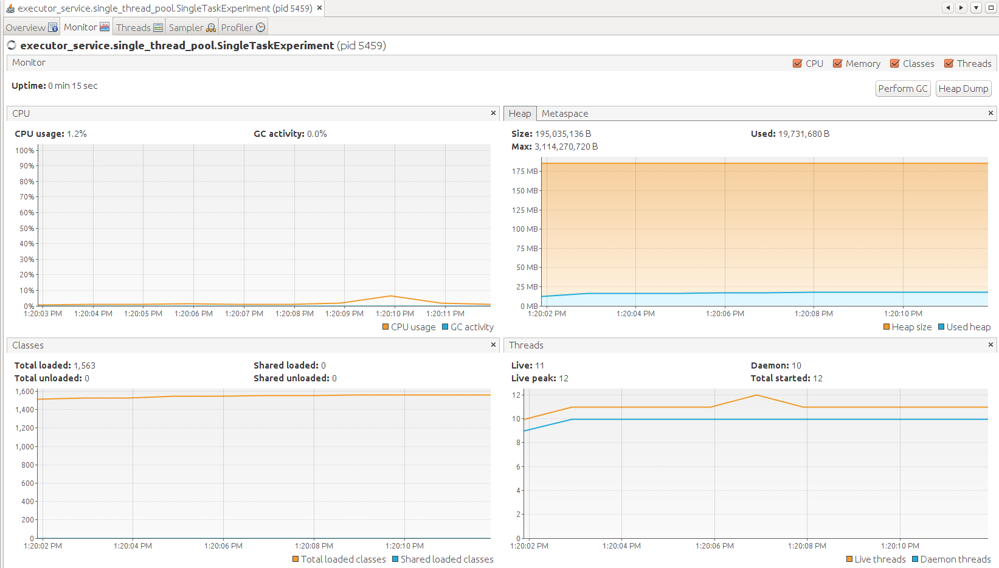
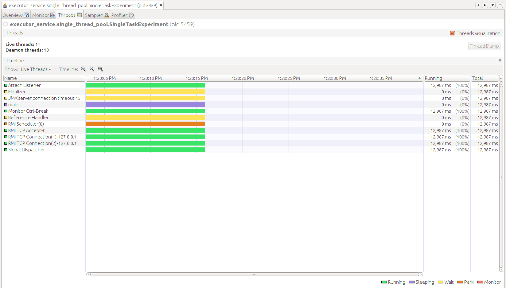
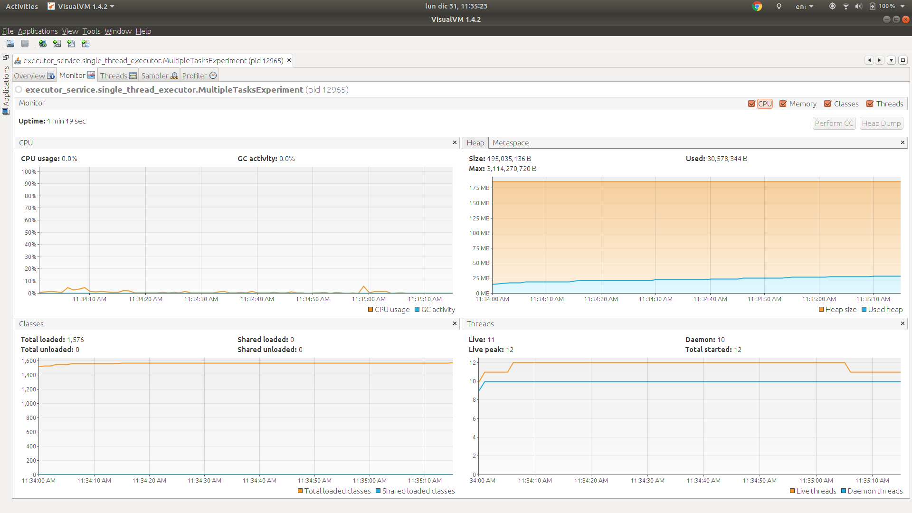
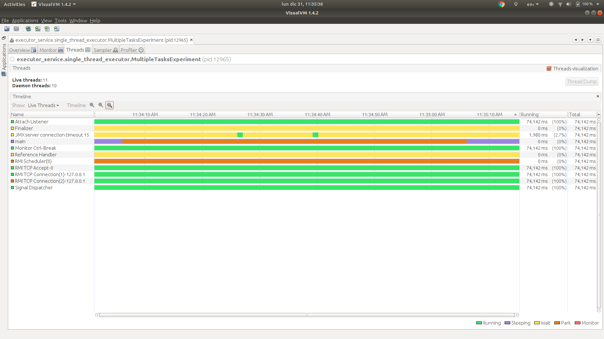

# Single thread executor

> public static ExecutorService newSingleThreadExecutor()
> 
> Creates an Executor that uses a single worker thread operating off an unbounded queue. (Note however that if this single thread terminates due to a failure during execution prior to shutdown, a new one will take its place if needed to execute subsequent tasks.) Tasks are guaranteed to execute sequentially, and no more than one task will be active at any given time. Unlike the otherwise equivalent newFixedThreadPool(1) the returned executor is guaranteed not to be reconfigurable to use additional threads.

Source: https://docs.oracle.com/javase/7/docs/api/java/util/concurrent/Executors.html#newSingleThreadExecutor()

## Description

We have two experiments in this package:

### 1. Send a single task to the executor.

In this experiment we will check:

1. A single task (runnable) is created.
1. The task is correctly dispatched using a single thread.
  
#### Results

**Stdout**

```
Start
Shutdown
End
Hello, my name is Thread 1
```

**VisualVM**

Monitor



* The thread count baseline is 11.
* The thread count increases to 12, why? Because the single thread executor was created.
* The thread count goes back to 11, why? Because the single thread executor was shutdown.

Threads



We can see there are no threads from the single thread executor alive when the program finishes.
This is what we expect because we shutdown the single thread executor.

### 2. Send multiple tasks to the executor.

In this experiment we will check:

1. 10_000 tasks are created.
1. All 10_000 tasks are dispatched using a single thread.
  
#### Results

**Stdout**

```
Name: Thread 5869, sum: 351
Name: Thread 5870, sum: 8911
Name: Thread 5871, sum: 474825
Name: Thread 5872, sum: 425503
Name: Thread 5873, sum: 82215
Name: Thread 5874, sum: 498501
Name: Thread 5875, sum: 69378
Name: Thread 5876, sum: 42778
Name: Thread 5877, sum: 391170
Name: Thread 5878, sum: 15
Name: Thread 5879, sum: 37128
Name: Thread 5880, sum: 153181
Thread 5881, error: sleep interrupted
Number of not executed tasks: 4119
End
```

Note the execution of the threads is in order. This is because we are using a single executor.

It is also important to highlight the two lines before `End`:
```
Thread 5881, error: sleep interrupted
Number of not executed tasks: 4119
```
These lines are shown because executor took more than one minute to execute the given 10k tasks.
After the minute the executor was forced to stop all its executing tasks. Because it is a single thead executor, onlu one task
was being executed at that time: `Thread 5881`.

Finally the executor indicates us how many tasks were not executed: `Number of not executed tasks: 4119`.

**VisualVM**

Monitor



* The thread count baseline is 11.
* The thread count increases to 12, why? Because the single thread executor was created.
* The thread count goes back to 11, why? Because the single thread executor was shutdown.

Threads



We can see there are no threads from the single thread executor alive when the program finishes.