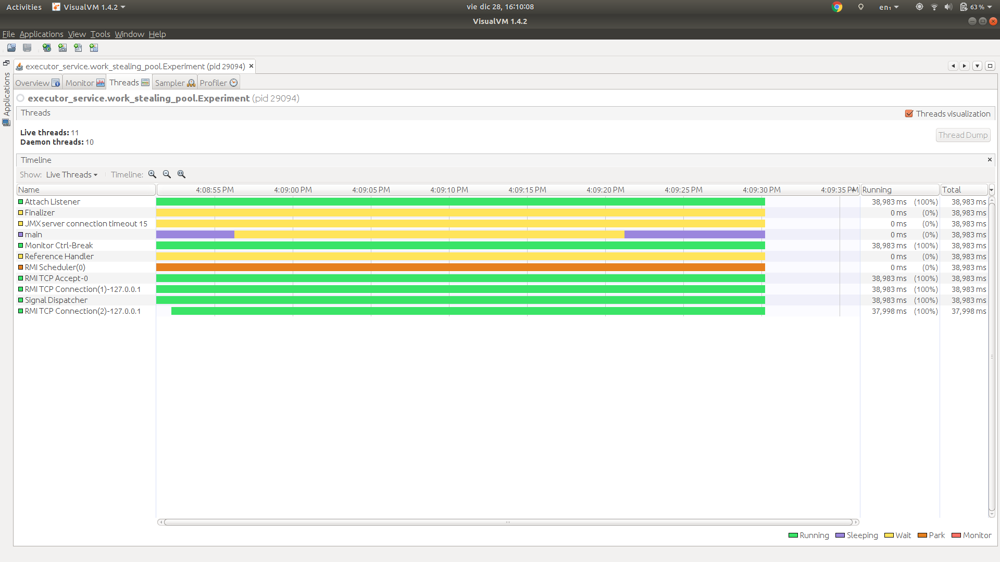

# Work stealing pool


> public static ExecutorService newWorkStealingPool()
> 
> Creates a work-stealing thread pool using all available processors as its target parallelism level.

Source: https://docs.oracle.com/javase/8/docs/api/java/util/concurrent/Executors.html#newWorkStealingPool--

This WorkStealingPool uses a ForkJoinPool. For more information about Java's Fork/Join framework please follow 
this link: https://docs.oracle.com/javase/tutorial/essential/concurrency/forkjoin.html

**Disclaimer**

The experiment for the Work stealing pool was not well designed. Why? Because the tasks executed by the thread pool did not
extend `RecursiveAction` or  `RecursiveTask`. So the full capacity of the Fork/Join framework is not showcased by this experiment.

## Description

We have one experiment in this package:

### 1. Send 10k tasks to a work stealing pool.

In this experiment we will check:

1. 10_000 tasks are created.
1. Only N extra threads are created. (N is the number of processors of the machine used to run the experiment)
1. All 10_000 tasks are dispatched using the new N threads.
  
#### Results

**Stdout**

```
Name: Thread 9940, sum: 419070
Name: Thread 9941, sum: 21736
Name: Thread 9942, sum: 269745
Name: Thread 9943, sum: 477753
Name: Thread 9944, sum: 265356
Name: Thread 9946, sum: 466095
Name: Thread 9945, sum: 138601
Name: Thread 9947, sum: 407253
Name: Thread 9949, sum: 165600
Name: Thread 9948, sum: 213531
Name: Thread 9950, sum: 107880
Name: Thread 9951, sum: 17578
Name: Thread 9952, sum: 91
Name: Thread 9953, sum: 300700
Name: Thread 9954, sum: 325
Name: Thread 9955, sum: 198135
Name: Thread 9957, sum: 383250
Name: Thread 9958, sum: 55
Name: Thread 9956, sum: 122265
Name: Thread 9959, sum: 15400
Name: Thread 9960, sum: 47586
```

Note the execution of the threads seems to be in order, but it is not.
This is because we are using a work stealing pool of only 4 threads.


Why 4 threads? This is the code that creates the work stealing pool:

```
public static ExecutorService newWorkStealingPool() {
    return new ForkJoinPool
        (Runtime.getRuntime().availableProcessors(),
         ForkJoinPool.defaultForkJoinWorkerThreadFactory,
         null, true);
}
```

As you can see it uses the line `Runtime.getRuntime().availableProcessors()` as parameter. The computer I used to run the experiments
had 4 processors.

**VisualVM**

Monitor


* The thread count baseline is 11.
* The thread count increases to 15, why? Because the 4 threads of the work stealing pool were created.
* The thread count goes back to 11, why? Because the 4 threads of the work stealing pool were shutdown.

Threads



We can see there are no threads from the work stealing pool alive when the program finishes.