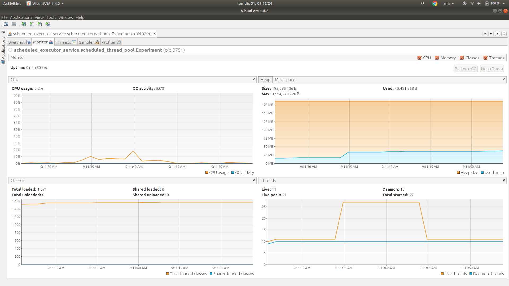
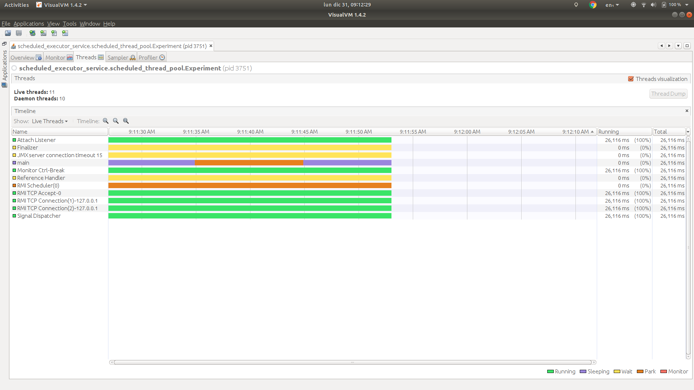

# Scheduled thread pool

> public static ScheduledExecutorService newScheduledThreadPool(int corePoolSize)
> 
> Creates a thread pool that can schedule commands to run after a given delay, or to execute periodically.

Source: https://docs.oracle.com/javase/8/docs/api/java/util/concurrent/Executors.html#newScheduledThreadPool-int-

## Description

We have one experiment in this package:

### 1. Send 10k tasks to a scheduled thread pool of 16 threads.

In this experiment we will check:

1. 10_001 tasks are created.
1. Only 16 extra threads are created.
1. All 10_000 tasks are dispatched using the new 16 threads.
1. One task was created but not dispatched, why? Because if scheduled thread pool is shut down, the tasks scheduled using the
   methods `scheduleAtFixedRate` and `scheduleWithFixedDelay` will not be executed.
  
#### Results

**Stdout**

```
Name: Thread 9989, sum: 106491
Name: Thread 9990, sum: 289941
Name: Thread 9991, sum: 106491
Name: Thread 9992, sum: 1596
Name: Thread 9993, sum: 21945
Name: Thread 9994, sum: 461280
Name: Thread 9995, sum: 13203
Name: Thread 9996, sum: 11476
Name: Thread 9997, sum: 107880
Name: Thread 9998, sum: 130816
Name: Thread 9999, sum: 357435
Name: Thread 10000, sum: 18915
```

Note the execution of the threads are in order. This is because we are scheduling each task one millisecond after the other.

**VisualVM**

Monitor



* The thread count baseline is 11.
* The thread count increases to 27, why? Because the 16 threads of the scheduled thread pool were created.
* The thread count goes back to 11, why? Because the 16 threads of the scheduled thread pool were shutdown.

Threads



We can see there are no threads alive from the scheduled thread pool when the program finishes.
This is what we expect because we shut down the scheduled thread pool.