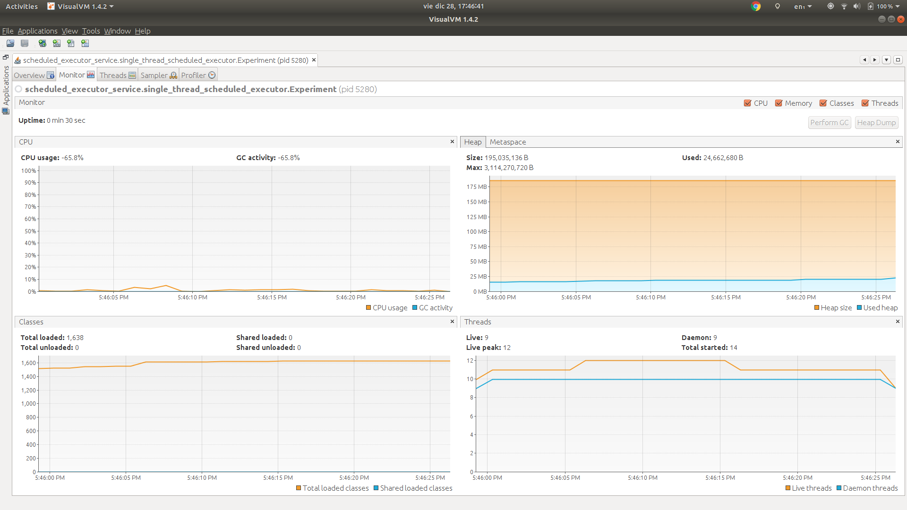
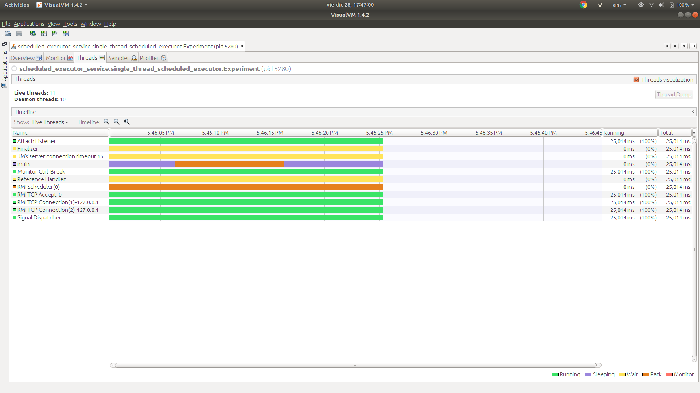

# Single thread scheduled executor

> public static ScheduledExecutorService newSingleThreadScheduledExecutor()
>
> Creates a single-threaded executor that can schedule commands to run after a given delay, or to execute periodically. (Note however that if this single thread terminates due to a failure during execution prior to shutdown, a new one will take its place if needed to execute subsequent tasks.) Tasks are guaranteed to execute sequentially, and no more than one task will be active at any given time. Unlike the otherwise equivalent newScheduledThreadPool(1) the returned executor is guaranteed not to be reconfigurable to use additional threads.

Source: https://docs.oracle.com/javase/7/docs/api/java/util/concurrent/Executors.html#newSingleThreadScheduledExecutor()

## Description

We have one experiment in this package:

### 1. Schedule multiple tasks using the single thread scheduled executor.

In this experiment we will check:

1. Two tasks are created.
1. The two tasks are dispatched on schedule using the executor.
  
#### Results

**Stdout**

```
Start
Shutdown
Name: Thread 1, date: 2018-12-28T17:46:06.030
Name: Thread 1, date: 2018-12-28T17:46:10.997
Name: Thread 1, date: 2018-12-28T17:46:15.997
End

Process finished with exit code 0
```

Note that `Thread 2` was never dispatched, why? Because if the executor is shut down, the tasks scheduled using the
methods `scheduleAtFixedRate` and `scheduleWithFixedDelay` will not be executed.

**VisualVM**

Monitor



* The thread count baseline is 11.
* The thread count increases to 12, why? Because the single thread scheduled executor was created.
* The thread count goes back to 11, why? Because the single thread scheduled executor was shutdown.

Threads



We can see there are no threads alive from the single thread scheduled executor when the program finishes.
This is what we expect because we shut down the single thread scheduled executor.